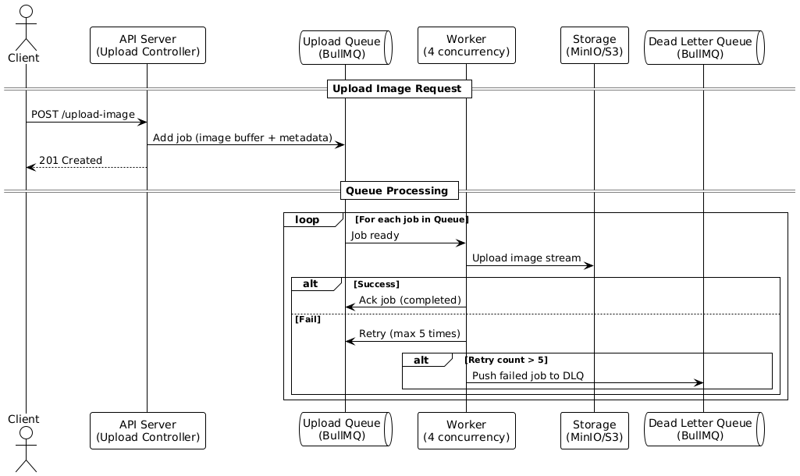

# Tăng performance cho API upload ảnh lên cloud storage

## Vấn đề
- API server bị quá tải khi xử lý nhiều ảnh lớn đồng thời
- Làm tăng độ trễ gây ảnh hưởng tới luồng xử lý chính

## Mục tiêu
- Tăng khả năng chịu tải khi nhiều người upload ảnh cùng lúc
- Đảm bảo hiệu năng ổn định, scale tốt

## Hướng giải quyết

Để tối ưu hiệu năng upload ảnh, giải pháp được áp dụng là:

### Stream Upload + Queue (BullMQ) + Worker xử lý

Thay vì xử lý toàn bộ ảnh trong API request, hệ thống được tách làm hai phần:

1. **API nhận ảnh (NestJS Controller)**
   - Sử dụng `Multer` kết hợp `stream.Readable` để nhận ảnh từ client mà không cần load toàn bộ ảnh vào RAM.
   - Tạm lưu ảnh (hoặc buffer) và đẩy job vào hàng đợi (BullMQ).

2. **Queue (BullMQ)**
   - API gửi job vào hàng đợi với các thông tin ảnh (tên file, đường dẫn tạm, buffer, metadata…).
   - Việc này giúp API phản hồi sớm, không chặn request.

3. **Worker xử lý upload (NestJS App khác hoặc module riêng)**
   - Worker lắng nghe queue `upload-image`.
   - Khi có job, worker:
     - Đọc dữ liệu ảnh (từ buffer hoặc file tạm)
     - Upload ảnh lên S3 hoặc MinIO bằng stream
     - Ghi log vào DB hoặc lưu metadata

## Công nghệ sử dụng

| Thành phần | Công nghệ |
|------------|----------|
| API Backend | [NestJS](https://nestjs.com/) |
| Upload handler | [Multer](https://github.com/expressjs/multer), `stream.Readable` |
| Queue | [BullMQ](https://docs.bullmq.io/), `@nestjs/bull` |
| Cloud Storage | AWS S3 (hoặc [MinIO](https://min.io/)) |
| Test hiệu năng | [k6](https://k6.io/) |
| Monitor Queue | [Bull Board](https://github.com/felixmosh/bull-board), custom log |

## Sơ đồ mô tả hệ thống



### Giải thích từ khóa
#### 🔁 `loop`
- Diễn tả hành động lặp lại, ví dụ: xử lý từng job trong queue.

#### 🔀 `alt`
- Thể hiện nhánh điều kiện (if/else): thành công → ack, thất bại → retry hoặc đẩy vào DLQ.

#### ⚙️ `Worker`
- Thực thi các job từ queue.
- Có thể config `concurrency: 4` để xử lý song song 4 job.

#### ✅ `Completed job`
- Worker xác nhận job đã xử lý thành công → không retry nữa.

#### 🔁 `Retry`
- Job fail sẽ được retry (tối đa 5 lần tùy config trong BullMQ).

#### ☠️ `DLQ` (Dead Letter Queue)
- Lưu trữ job bị lỗi sau nhiều lần retry thất bại.
- Dùng để kiểm tra, debug, hoặc xử lý lại sau.


## Test performance
- Hiện tại, hệ thống đang được kiểm thử hiệu năng bằng công cụ k6 dưới dạng container (Docker). Mục tiêu là đánh giá khả năng chịu tải của API upload ảnh.

| Từ khóa               | Giải thích                                                                                                              |
| --------------------- | ----------------------------------------------------------------------------------------------------------------------- |
| **k6**                | Một công cụ mã nguồn mở để test hiệu năng, được viết bằng Go, kịch bản test dùng JavaScript.      |
| **VU (Virtual User)** | Mỗi VU là một user giả lập gửi request đến hệ thống. Có thể config nhiều VU để mô phỏng tải lớn.                        |
| **duration (`dur`)**  | Khoảng thời gian mà bài test chạy. Ví dụ `10s`, `1m`,...                                                                |
| **iteration**         | Một lượt chạy kịch bản của một VU (gửi 1 request hoặc 1 loạt request).                                                  |
| **check**             | Một biểu thức kiểm tra kết quả, ví dụ: status code phải là `201`, thời gian upload phải nhỏ hơn `1000ms`.               |
| **benchmark**         | Là quá trình đo lường hiệu năng hệ thống theo thời gian, độ trễ, throughput, etc.                                       |
| **p(90), p(95)**      | Percentile: 90% hoặc 95% request có thời gian phản hồi nhỏ hơn giá trị này. Giúp hiểu rõ worst-case (gần như xấu nhất). |


### Giải thích chi tiết các từ khóa trong báo cáo K6

#### TOTAL RESULTS
| Từ khóa                  | Giải thích                                                                                 |
| ------------------------ | ------------------------------------------------------------------------------------------ |
| `checks_total`           | Tổng số lần kiểm tra điều kiện (check). Mỗi lần test có thể chứa nhiều điều kiện kiểm tra. |
| `checks_succeeded`       | Số lượng check đạt yêu cầu.                                                                |
| `checks_failed`          | Số lượng check thất bại.                                                                   |
| `✓ status is 201`        | Một check cụ thể: API phải trả về status code `201 Created`.                               |
| `✓ upload took < 1000ms` | Một check khác: thời gian upload phải nhỏ hơn 1000ms.                                      |

#### HTTP
| Từ khóa                      | Giải thích                                                                                                  |
| ---------------------------- | ----------------------------------------------------------------------------------------------------------- |
| `http_req_duration`          | **Tổng thời gian phản hồi** của mỗi HTTP request (tính cả DNS lookup, TCP connect, TLS, gửi, chờ response). |
| `avg`                        | Giá trị **trung bình** thời gian phản hồi.                                                                  |
| `min`                        | **Thời gian phản hồi ngắn nhất** (tốt nhất).                                                                |
| `med` (median)               | **Giá trị trung vị** – 50% request nhanh hơn, 50% chậm hơn.                                                 |
| `max`                        | **Thời gian phản hồi lâu nhất** (tệ nhất).                                                                  |
| `p(90)`                      | **Percentile 90** – 90% request nhanh hơn giá trị này.                                                      |
| `p(95)`                      | **Percentile 95** – 95% request nhanh hơn giá trị này.                                                      |
| `{ expected_response:true }` | Chỉ tính các request có response hợp lệ (`status 2xx`, không lỗi).                                          |
| `http_req_failed`            | Tỷ lệ request bị lỗi (timeout, 5xx, 4xx...). VD `0%`, tức là **không có lỗi**.                              |
| `http_reqs`                  | Tổng số HTTP request được gửi. VD `40.39/s` là tần suất gửi trung bình mỗi giây.                            |

#### EXECUTION
| Từ khóa              | Giải thích                                                                              |
| -------------------- | --------------------------------------------------------------------------------------- |
| `iteration_duration` | Thời gian trung bình mỗi vòng lặp của 1 VU (bao gồm logic JS và request).               |
| `iterations`         | Tổng số vòng lặp (số lần mỗi VU thực hiện kịch bản).                                    |
| `vus`                | **Virtual Users** – Số lượng user ảo chạy đồng thời.                                    |
| `vus_max`            | Số lượng VU cao nhất trong quá trình test.                                              |


#### NETWORK
| Từ khóa         | Giải thích                                                             |
| --------------- | ---------------------------------------------------------------------- |
| `data_received` | Tổng dung lượng dữ liệu được **nhận về** từ server.                    |
| `data_sent`     | Tổng dung lượng dữ liệu được **gửi đi** – ở đây là upload ảnh          |
| `kB/s`, `MB/s`  | Tốc độ truyền dữ liệu trung bình mỗi giây.                             |


## Chạy project 

### Dùng container

```bash
docker compose up --build
```

```bash
docker compose up
```
### Chạy test k6

```bash
docker exec k6 k6 run /mnt/k6-test/upload-image-test.js
```

## Set up minio local

```bash
curl -O https://dl.min.io/client/mc/release/linux-amd64/mc
chmod +x mc
sudo mv mc /usr/local/bin/
```

```bash
sudo apt update && sudo apt install jq
```

### Set local minio 
```bash
mc alias set local http://localhost:9000 minioadmin minioadmin123
```

### Đếm số lượng object

```bash
mc ls --recursive --json local/my-bucket | jq -s 'length'
```